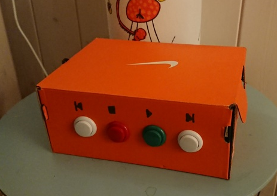
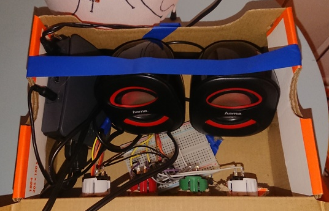

kids-radio-service
==================

 
 
 Not pretty, but it works just fine:
 
 
 Function
 ----------

First Prototype: Replays audioHandles once to test sound output from rpi3 
when running inside docker container via balena

Using, balena-cloud.io.

Therefore Dockerfile.template [Doc: #dockerfile-templates](https://www.balena.io/docs/learn/develop/dockerfile/#dockerfile-templates)

Push to balena:
--------------

`git push balena`

Info: If you see the error _Could not create directory '/x//.ssh'._ try
to use *git bash* or minggw. Then do `balena login` and retry push to
balena remote
